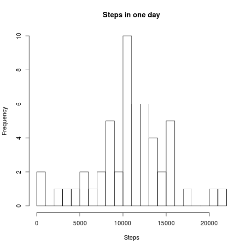
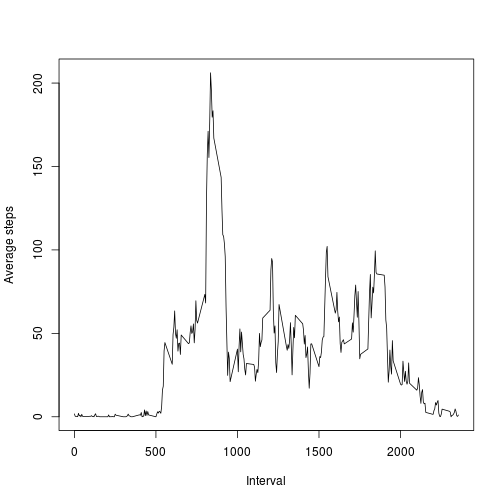
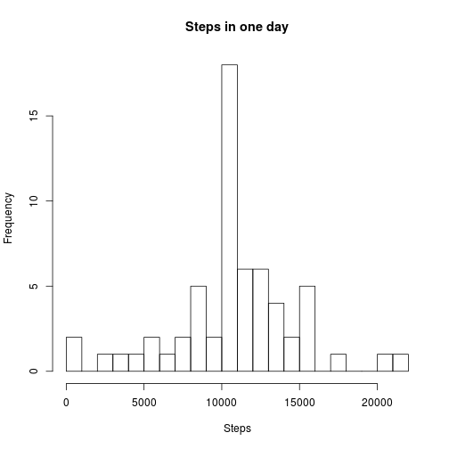
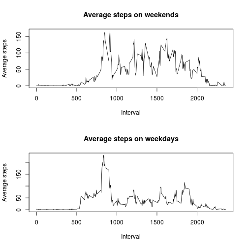

##Reproducible Research

###Read data.
First we read the data. For convenience, we use POSIXct for the date.


```r
data <- read.csv("activity.csv")
data$date <- as.POSIXct(data$date,format="%Y-%m-%d")
```

###Clean data. Histogram of steps.
Create a new table with only the complete cases. For the first analysis we are going to ignore the missing values.


```r
cldata <- data[complete.cases(data),]
```

We are using the package plyr.


```r
library(plyr)
```

Compute the sum of steps, grouped by day.


```r
ssteps<-ddply(cldata,~date,summarise,sum=sum(steps))
```

Histogram of the total number of steps per day.


```r
hist(ssteps$sum,main="Steps in one day",xlab="Steps",breaks=20)
```

 

Finally, compute the mean and the median of the number of steps per day.


```r
mean(ssteps$sum)
```

```
## [1] 10766.19
```

```r
median(ssteps$sum)
```

```
## [1] 10765
```

###Average of steps.
Now compute the average number of steps in each interval.

```r
avsteps<-ddply(cldata,~interval,summarise,average=mean(steps))
```

Plot the averages for each interval.


```r
plot(avsteps$interval,avsteps$average,type='l',xlab="Interval",ylab="Average steps")
```

 

We find the interval with higher average.


```r
avsteps[avsteps$average==max(avsteps$average),]
```

```
##     interval  average
## 104      835 206.1698
```

###Missing values
The number of rows with missing values can be computed as follows.


```r
sum(!complete.cases(data))
```

```
## [1] 2304
```

We are going to fill any missing value with the average for that interval.


```r
fdata<-merge(data,avsteps,by="interval")
fdata[!complete.cases(fdata),"steps"]<-fdata[!complete.cases(fdata),"average"]
```

Now, compute again the histogram, mean, and median of total number of steps per day, using the filled data.


```r
sfsteps<-ddply(fdata,~date,summarise,sum=sum(steps))

hist(sfsteps$sum,main="Steps in one day",xlab="Steps",breaks=20)
```

 

```r
mean(sfsteps$sum)
```

```
## [1] 10766.19
```

```r
median(sfsteps$sum)
```

```
## [1] 10766.19
```

We are using the average to fill the missing data, so the averaged result does not change. Changes are visible in the histograms. 


###Activity by day type.
Add a one column, "dtype", a factor with values "weekend" and "weekday" indicating the type of the day.


```r
fdata$dtype <- factor(weekdays(fdata$date)=="Saturday" | weekdays(fdata$date)=="Sunday",levels=c(TRUE,FALSE),labels=c("weekend","weekday"))
```

Compute the average number of steps, grouped by day type and interval.


```r
avwsteps<-ddply(fdata,as.quoted(c("dtype","interval")),summarise,average=mean(steps))
```

Finally, plot the results.


```r
par(mfrow=c(2,1))
plot(avwsteps[avwsteps$dtype=="weekend","interval"],avwsteps[avwsteps$dtype=="weekend","average"],type='l',xlab="Interval",ylab="Average steps",main="Average steps on weekends")
plot(avwsteps[avwsteps$dtype=="weekday","interval"],avwsteps[avwsteps$dtype=="weekday","average"],type='l',xlab="Interval",ylab="Average steps",main="Average steps on weekdays")
```

 
